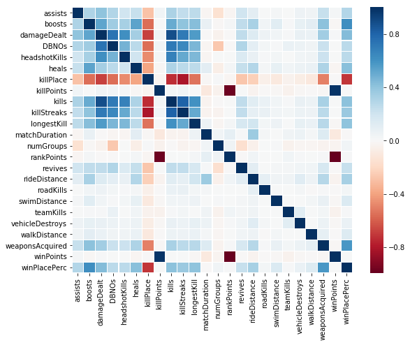
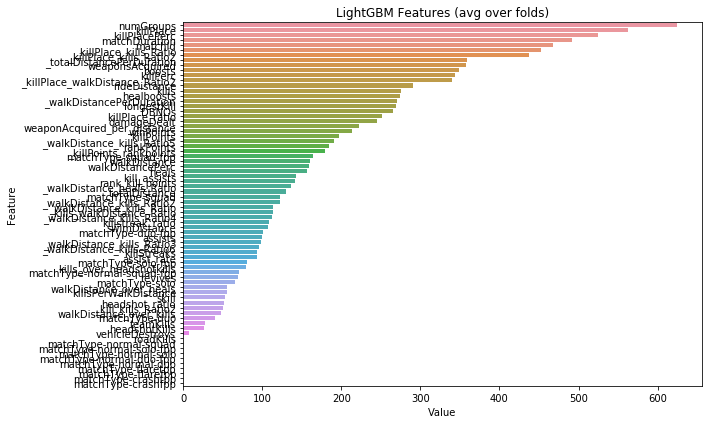

# 第一回コンペまとめ

コンペでやったことまとめます。それぞれについて軽くではありますが，わかりやすく説明できればと思います。

- **初めに**
<br><br>
- **EDA**
    - 分析
    - いろいろ試してみる
    - 特徴量選択
<br><br>
- **試した手法**
    - モデル選択
    - emsemble
    - stacking
    - パラメータチューニング
<br><br>
- **その他・感想含め**

## はじめに

・ PUBGとは(軽く)

PUBGとは，FPS・TPS式のサバイバルゲームです。最大(かどうかは忘れたけど)100人のプレイヤーが無人島でバトルロイヤル方式で戦って，最後まで生き残りをかけて争います。最後まで生き残ったら勝利すなわち__ドン勝__です。つまりwinPlacePerc=1.0⇔ドン勝です。スタートは上空で，地上に降りた人たちが武器や車を使いこなします。

・コンペについて

今回予測するのは，あるプレイヤーのドン勝率です。与えられたデータの説明変数として，そのプレイヤーのkill数や移動距離や回復量などがあります。ただし，注意するのはこのパラメータは試合終了時です。

## EDA
一番時間使いました。

### 分析
とりあえず，可視化してみるのがいいと思います。各変数の説明変数の相関係数を図で示します。

これをもとに相関係数が高い奴の片方を除去したり，あるいは相関係数が低いやつの交差項(除算なり乗算なり)を求める指標にします。


### いろいろ試してみる

こればっかりは試してみるしかありません。今回僕が試した方法として，
1. 交差項を生成
2. Target Encoding
3. ドメイン知識の利用
です。交差項の生成については，諸々の特徴量をかけたり割ったりして試行錯誤します。他に，sklearnの標準モジュールに`PolynomialFeatures`という、すべての特徴量の2次の交差項を求めてくれる便利なものを使いましたが，あまりうまくいかなかった印象でした。あとは，相関係数の低い特徴量同士の交差項を300個生成したりしましたが，こちらもあまり精度が伸びなかった印象です。

Target Encodingはカテゴリタイプの特徴量にたいして有効です。今回の場合はmatchTypeです。これはNLPでありがちなワンホットベクターを生成してくれます。カテゴリタイプはこれ一択だと思います。今回，matchTypeにはsoloやduoだけでなく，solo-fppやsquad-tppなど細かく16種類あります。そこで，考えた案として，それぞれのカテゴリをsolo，duo，squad等の情報に圧縮するか，そのまま16カテゴリで用いるかです。over-fittingの可能性も考慮すると，データの情報量が多ければ多いほどいいというわけでもないので，これは実験するしかないです。今回はそのまま用いた(ような気がします)。

ドメイン知識とはちょっとしたメタ的な情報です。例えば，FPSゲーでありがちなKDA(今回は死んだら終わりなのでD=1だったり)，ヘッドショット率などがこれに当てはまります。あとは，今回は同一試合で100人なので，matchTypeでグループ化するなどすると有効だったような気がします。扱った特徴量についてはコードを参照してください。

### 特徴量選択

特徴量は絞ったほうがいいと思います。理由としては，単純に精度が上がるというのと，計算時間が早まるからです。具体的な手法として，
1. 相関が高い特徴量のうち片方を削除
2. Null Importance
3. SHAP(知らなかった)
4. feature importanceの利用

とかがあります。
今回僕は1と4を使用しました。例えば，LightGBMのfeature_importanceというものを用いると，

こんな感じで出力できます。(ぐっちゃぐちゃですいません。)

## 試した手法

### モデル選択
ここから具体的なモデル構築になるのですが，試したモデルとして
1. 決定木
2. ランダムフォレスト
3. 勾配ブースティング
4. ~~NN~~(時間の都合で試せず)

をそれぞれ試しました。勾配ブースティングが最も精度が出てましたけど，アンサンブル・スタッキングも考慮してまだ残しておきます。
それぞれのモデルに強み・弱みがある(例えば勾配ブースティングは線形和に弱いとか。。。)ので，その辺から勉強しました。

### ensemble
アンサンブル学習は，複数の学習器を組み合わせて1つの学習器を用いる方法です。今回，途中結果のスコアを重みに反映し，新しい予測値を得るなどしましたが，詳しい吟味の時間があまりとれず，最終結果には使いませんでした。

### stacking
名前のとおりですが学習器を積み上げる方法で，データをKFoldして，複数の学習器を並列に弱学習器として用い，その出力を線形回帰のような学習器に入れる方法です。

http://segafreder.hatenablog.com/entry/2016/05/24/235822

この記事が非常にわかりやすいです。弱学習器には，kNNやランダムフォレストやboosting treeを使うと精度が出やすい(らしいです)。
今回，僕はこれを軸にモデルを構築しました。試行錯誤して，lightgbm3つを弱学習器にして，その後ポアソン回帰させました。(なぜか線形回帰より精度が高かった。)

### パラメータチューニング
この辺は試行錯誤するしかないような気がします。やり方は1つのパラメータを変化させて，それをメモ取って，いい感じになったら別のパラメータについても変化させていくという感じです。今回，スタッキングを用いるにあたり，できるだけ違う感じにパラメータをチューニングさせた。

## その他・感想含め
今回，大幅にスコアを伸ばせる要因はmatchIdとgroupIdがtrainとtestで共通のものがあったというところかなと思う。当たり前であるが，バトルロイヤルのチーム戦は死んだ時点で終了なので，同じ試合の同じグループは勝率が近いだろうということで，testデータのmatchIdとgroupIdが同じものを勝率をtrainデータから平均として予測し，それもtrainデータに含めるという手法をとった(かなりグレイな手法であるが)。それ含めて，やはり一番時間を費やして研究するべきなのは与えられた特徴量を自分なりに分解してみることだと思います。

今回コンペ内容が僕の好きなFPSゲーだったので，なんとか上位入賞できたのはうれしい。あと2回(2回目はもう始まってますが)，わいわい競えたらいいなと思います。それでは皆さん頑張りましょう。(~~ちなみに僕はApexLegendsのほうが好きです~~)


```python

```
